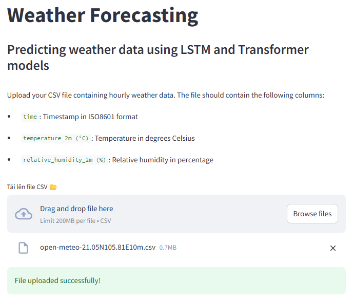
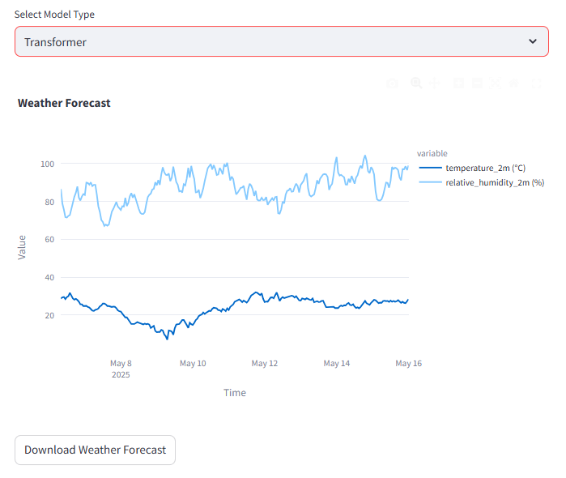
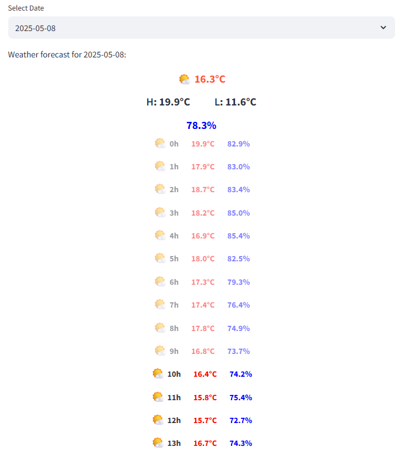
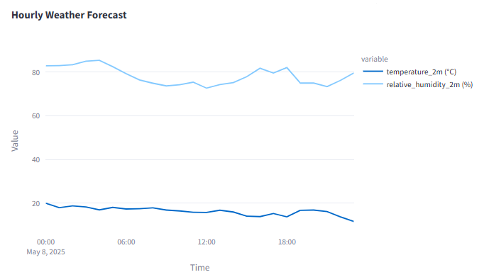

# Weather Prediction

This project uses two main models — LSTM and Transformer — to predict temperature and humidity. The application is built with Streamlit for easy deployment and interactive visualization.

URL Streamlit Website: https://weatherforecasting-22022594-namtt.streamlit.app

## Table of Contents
- [Data Infomation](#data-information)
- [Installation](#installation)
- [Usage](#usage)
- [Model](#model)
- [Result](#results)
## Data Information
### Daily data
- `temperature_2m_mean (°C)`: Mean daily temperature at 2 meters above ground.
- `temperature_2m_min (°C)`: Daily minimum temperature.
- `temperature_2m_max (°C)`: Daily maximum temperature.
- `relative_humidity_2m_mean (%)`: Mean daily relative humidity at 2 meters above ground.
### Hourly data
- `temperature_2m (°C)`: Hourly temperature at 2 meters above ground.
- `precipitation (mm)`: Hourly precipitation.
## Website infomation
### Upload data
Upload your CSV file containing hourly weather data. The file should contain the following columns:

- `time`: Timestamp in ISO8601 format.
- `temperature_2m (°C)`: Temperature in degrees Celsius.
- `relative_humidity_2m (%)`: Relative humidity in percentage.


### Viewer

<b>You can dowload data predicted.</b>




## Installation
1. Clone the repository:

```sh
git clone https://github.com/NamSeko/Weather_Prediction.git
cd Weather_Prediction
```

2. Install the required packages:

```sh
pip install -r requirements.txt
```
## Usage
To run the Streamlit application, use the following command:

```sh
streamlit run GUI/streamlit.py
```
Local URL: `http://localhost:8501`

Network URL: `http://ip_network:8501`
## Model
- WeatherLSTM
- WeatherTransformer
## Results
### LSTM Model
|||`MAE`|`RMSE`|`R2`|
|-|-|-----|------|----|
|`Daily`|`Temperature`|2.04°C|2.62°C|0.71|
||`Relative Humidity`|8.15%|10.14%|0.08|
|`Hourly`|`Temperature`|1.07°C|1.30°C|0.93|
||`Relative Humidity`|3.77%|4.60%|0.93|
### Transformer Model
|||`MAE`|`RMSE`|`R2`|
|-|-|-----|------|----|
|`Daily`|`Temperature`|1.03°C|1.42°C|0.91|
||`Relative Humidity`|4.69%|6.10%|0.65|
|`Hourly`|`Temperature`|0.38°C|0.54°C|0.99|
||`Relative Humidity`|2.37%|3.44%|0.96|